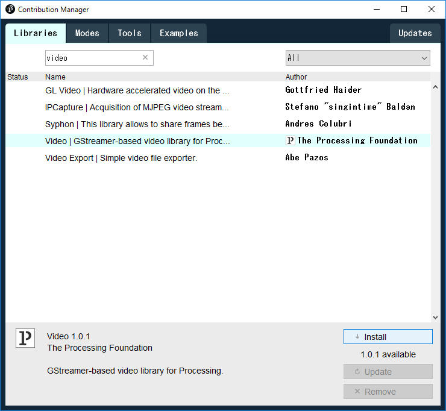
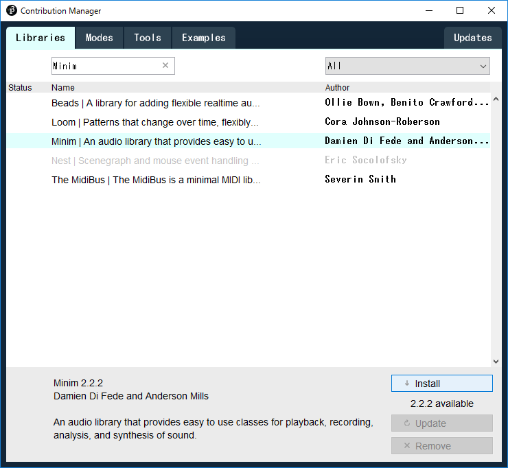
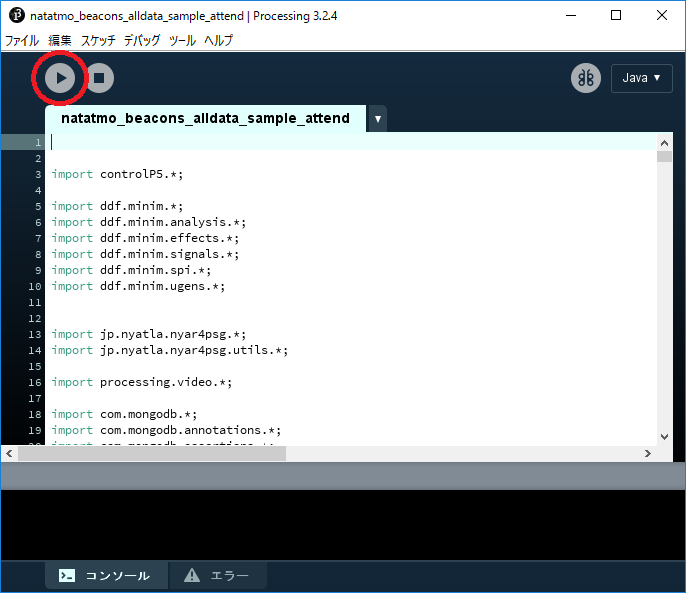
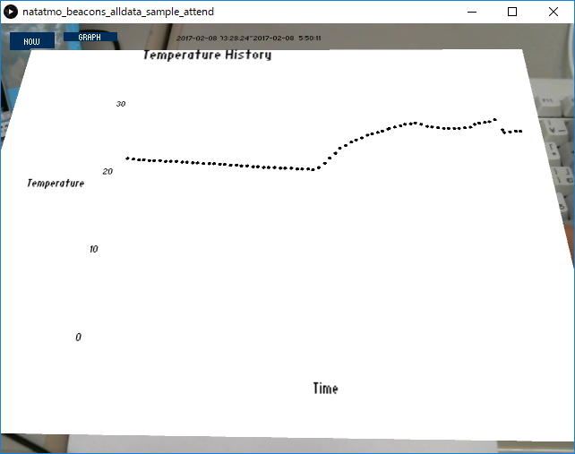
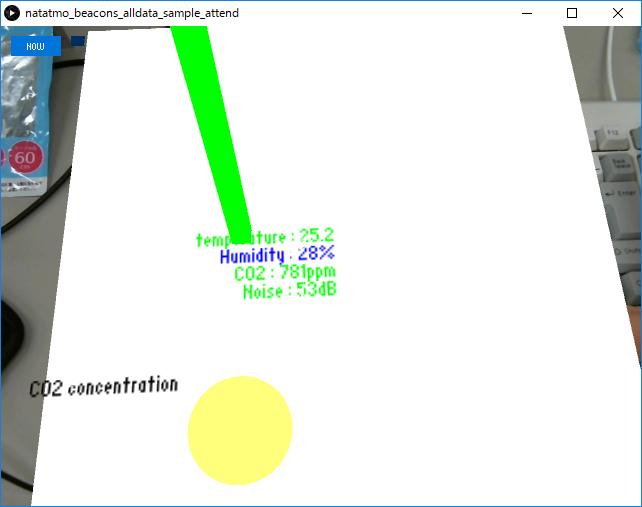
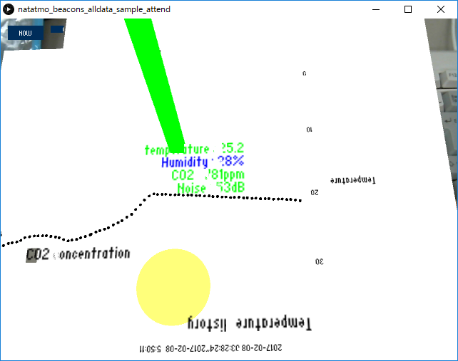

# ARProcessing
## 前提  
本研究のアプリケーションはhttps://github.com/igakilab/rooms-raspi ,https://github.com/igakilab/nasubi-rooms  
両リポジトリのアプリケーションが稼働中であることを前提としている.  
そのため,本研究を実行する前に前述のリポジトリを参照し,セットアップする必要がある.  
また,MongoDBのサーバが起動中であることも必要である.  
https://igakilab.gitbooks.io/gt-2016-mojava-manual/content/mongodb.html を参照し,セットアップを完了しておくこと.

## Processingのインストール
本研究のアプリケーションはProcessingを利用する.以下はそのインストール手順である.  

1. Processingの公式ページにアクセスし,左サイドメニューからDownloadを選択  
https://processing.org/  

2. No Donationを選択し,Downloadボタンをクリック  

3. 自分のPC環境にあったリンクをクリックするとzipファイルのダウンロードが開始される.これを任意の方法で展開すればインストール完了である.  
 
## Processingのライブラリ群の導入  
本研究のアプリケーションはいくつかのProcessingライブラリの導入を前提としている.以下に導入の手順を記す.  

1. Processingのインストールにて展開した processing.exe を1度起動し, C:\Users\{ユーザ名}\ドキュメント に Processing フォルダを生成する.なお,Processingの起動毎に表示されるWelcome to Processing 3のウィンドウは左下のチェックマークを外した上で横のGet Startedボタンをクリックすることで表示されなくなる.

2. MongoDBのライブラリを導入する.まずは以下のリンクからjarファイルをダウンロードする.  
https://repo.maven.apache.org/maven2/org/mongodb/mongo-java-driver/3.3.0/mongo-java-driver-3.3.0.jar

3. ドキュメントの Processing フォルダの libraries フォルダの中で新しいフォルダを作成し,"mongodb-java-driver-3.3.0"とリネームする.

4. 作成した mongodb-java-driver-3.3.0 フォルダ内にさらに library フォルダを作成し、その中にダウンロードしたjarファイルを配置する.

5. https://github.com/nyatla/NyARToolkit-for-Processing/releases/download/v5.0.5/nyar4psg.zip をダウンロードし,展開したフォルダをドキュメントの libraries フォルダに配置する.

6. processing.exe を起動し,メニューバーから スケッチ->ライブラリをインポート->ライブラリを追加 と選択する.検索欄(Filterと表示されている)にvideoと入力するといくつかライブラリが表示されるので,以下の図と同様のものをインストールする.  

7. processingのメニューバーから スケッチ->ライブラリをインポート と再度選択すると,Video という選択肢が増えていることを確認する.

8. 6, 7と同様に音声出力用のMinimライブラリ,ボタンを作成するControlP5ライブラリをそれぞれインポートする.下の図を参考にすること.  
  

以上の手順により5つのライブラリを導入することで,本研究のアプリケーションを実行する環境が整う.  

## 準備と実行
リリース用のファイルを以下のURLからダウンロードし,任意の場所に展開する.  
https://github.com/igakilab/ARProcessing/archive/for_release.zip  
展開したフォルダの階層は以下のようになっている.  

natatmo_beacons_alldata_sample_attend  
│　natatmo_beacons_alldata_sample_attend.pde  
│  
├─armarker_for_print  
│　　　…  
└─data  
　　│　…  
　　└─armarker  
　　　　…  

アプリケーションで利用するARマーカーが armarker_for_print に格納されているため,まずはこのフォルダのdocxファイルをすべて印刷する.  
  
natatmo_beacons_alldata_sample_attend.pde をProcessingで開くと以下のような画面が表示される.  
USBカメラを接続し,左上の実行ボタンをクリックするとアプリケーションが実行される.  

## プログラムを開かずに実行する  
プログラムが実行でき,データを取得することが可能になれば,  
Processingのファイル->アプリケーションとしてエクスポートする  
を実行することで,実行可能なアプリケーションとそのためのファイル群が application.windows64 (application.windows32) フォルダとともに生成される.この中のexeファイルを実行することで,アプリケーション単体での利用が可能となる.

## 実行例
カメラで印刷したARマーカーを映すと,グラフまたはビーコンの移動状況が表示される.  
画面左上のGRAPHをクリックするとグラフの表示が消え、もう一度クリックすると表示が戻る.  
  
  
  
グラフの表示が消えた状態で画面左上のNOWをクリックすると,以下の画像のようになる.  
  
  
  
グラフが表示された状態でNOWをクリックすると表示がおかしくなるため,やらないほうがよい.  
  
